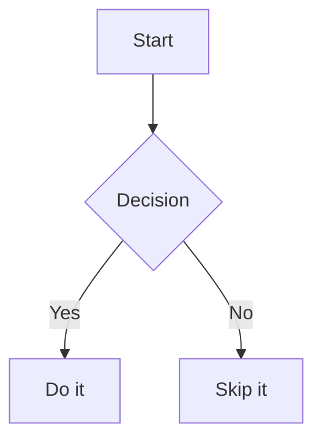

# Arcadia

[](https://github.com/TheTiresias/arcadia/actions/workflows/ci.yml)

**[Live demo →](https://thetiresias.github.io/arcadia)**

A Tufte-style static site generator for writing. Supports blog posts, long-form fiction, and slide decks — all from plain markdown.

Built with [Tufte CSS](https://edwardtufte.github.io/tufte-css/), [pulldown-cmark](https://github.com/raphlinus/pulldown-cmark), [mermaid-rs-renderer](https://github.com/1jehuang/mermaid-rs-renderer), and [toml](https://github.com/toml-rs/toml). No framework, no bundler — just a Rust binary.

---

## Getting Started

```
cargo install --path .
arcadia new
arcadia build
```

Output goes to `dist/`. Open `dist/index.html` in a browser to view the site.

---

## Using This as a Template

1. **Scaffold a new site** — run `arcadia new` to create the directory structure and a sample post.

2. **Set your site title** — edit `arcadia.toml` in the project root:
   ```toml
   title = "Your Site Name"
   ```

3. **Remove the example content** — delete the sample files from `example/posts/`, `example/fiction/`, and `example/decks/` when you're ready to start fresh.

4. **Start writing** — use `arcadia new post <slug>`, `arcadia new fiction <slug>`, or `arcadia new deck <slug>` to scaffold content.

---

## Content Types

### Blog Posts

Chronological writing. Lives in `example/posts/`.

```
arcadia new post <slug>
```

See [How to Write Posts](https://thetiresias.github.io/arcadia/posts/writing-posts.html) for full details.

### Fiction

Chapter-based long-form writing. Each story is a directory in `example/fiction/` containing a metadata file and one markdown file per chapter. Includes a generated table of contents and prev/next chapter navigation.

```
arcadia new fiction <slug>
```

See [How to Write Fiction](https://thetiresias.github.io/arcadia/posts/writing-fiction.html) for full details.

### Slide Decks

Presentation slides from markdown. Lives in `example/decks/`. Slides are separated by `---` and navigated with arrow keys or on-screen buttons.

```
arcadia new deck <slug>
```

See [How to Write Slide Decks](https://thetiresias.github.io/arcadia/decks/writing-decks.html) for full details.

---

## Project Structure

```
example/
  posts/          ← blog post markdown files
  fiction/
    {story}/      ← one directory per story
      story.md    ← story metadata
      *.md        ← chapter files
  decks/          ← slide deck markdown files
  resources/      ← static assets copied to dist/resources/
  images/         ← image files copied to dist/images/
  assets/         ← assets copied incrementally to dist/assets/

arcadia.toml      ← site config (title, content_dir, output_dir, port, …)
embed/            ← optional local template overrides (see arcadia eject)

src/              ← the build tool (Rust)
dist/             ← generated output (not committed)
  resources/
    tufte.css     ← always written from the binary (or embed/ override)
```

---

## Tufte Features

Arcadia supports two Tufte-specific markdown extensions in posts, fiction chapters, and slide decks:

**Sidenotes** — numbered, float to the right margin on wide screens:

```markdown
Here is a sentence.^[This is a sidenote.] Prose continues.
```

**Margin notes** — unnumbered, same position:

```markdown
Here is a sentence.>[This is a margin note.] Prose continues.
```

Images inside sidenotes and margin notes are automatically wrapped with a CSS-only lightbox — click to expand, click the backdrop to dismiss. No JavaScript required.

A `---` in posts and fiction chapters becomes a `<section>` break, which is the structural unit Tufte CSS expects.

---

## Diagrams

Arcadia renders [Mermaid](https://mermaid.js.org/) diagrams to inline SVG at build time — no JavaScript, no CDN dependency in the output.

Use a fenced code block with the `mermaid` language tag:

````markdown

````

Diagrams are supported in posts, fiction chapters, and slide decks. When `background_color` / `font_color` are set in frontmatter, diagram colors are derived from the page colors automatically.

---

## Tags

Any content type can be tagged by adding a `tags` field to its frontmatter:

```yaml
tags: [essay, climate, fiction]
```

The build generates:

- `tags/{tag}.html` — all content with that tag, grouped by type
- `tags.html` — master index of every tag with item counts

Tag links appear on post pages, fiction story ToC pages, and in the deck header. The home page links to `tags.html`.

Fiction tags belong to the story, not individual chapters — set them in `story.md`.

---

## Customising Templates

Arcadia's HTML output is driven by ten templates compiled into the binary. To customise them, run:

```
arcadia eject
```

This writes all ten templates into `embed/` in your project root. Edit any of them and the next build will use your version instead of the built-in one. Files you don't touch continue to use the defaults — you don't need to eject everything to change one template.

See [Customising Templates](https://thetiresias.github.io/arcadia/posts/customising-templates.html) for the full variable reference for each template.

---

## Commands

| Command | Description |
|---|---|
| `arcadia build` | Build the full site to `dist/` |
| `arcadia build --drafts` | Build including draft posts |
| `arcadia serve` | Build, serve locally at `http://localhost:3000`, and rebuild automatically on any source file change |
| `arcadia new` | Scaffold a new site skeleton |
| `arcadia new post <slug>` | Scaffold a new blog post |
| `arcadia new fiction <slug>` | Scaffold a new fiction story with a first chapter |
| `arcadia new deck <slug>` | Scaffold a new slide deck |
| `arcadia eject` | Copy all built-in templates into `embed/` for local customisation |
| `arcadia clean` | Delete the output directory (`dist/` by default) |

---

## Configuration

All settings are optional. Create `arcadia.toml` in the project root to configure the site.

```toml
title       = "My Site"          # used in page <title> and headings
description = "A site about …"  # not currently rendered, reserved for future use
author      = "Your Name"        # not currently rendered, reserved for future use
base_url    = "https://example.com"  # enables RSS feed and sitemap generation

content_dir = "example"          # where to look for posts/, fiction/, decks/, resources/, images/  (default: "example")
output_dir  = "dist"             # where to write the built site                (default: "dist")
port        = 3000               # port used by `arcadia serve`                 (default: 3000)
```

CLI flags (`--src`, `--output`, `--port`) take precedence over `arcadia.toml` when both are supplied.
