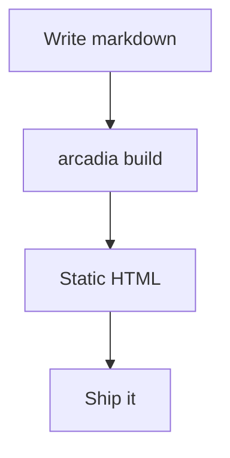

# An Example Deck

Navigate with **arrow keys**, **space**, or the buttons below.

Each `---` in the markdown starts a new slide.

---

## Text and Lists

- Plain markdown works as expected
- Lists, **bold**, *italic*, `code`
- Keep slides focused — one idea per slide

---

## Code

Fenced code blocks render normally:

```js
function nextSlide(current, total) {
  return Math.min(current + 1, total - 1)
}
```

---

## Diagrams

Mermaid diagrams render to inline SVG at build time — no JavaScript required:



---

## Quotes

> The greatest obstacle to discovery is not ignorance —
> it is the illusion of knowledge.
>
> — Daniel Boorstin

---

## The End

That's all. Press **←** to go back through.
