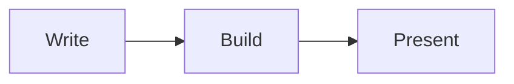

# How to Write Slide Decks

Slide decks live in `decks/`. Each file is a single deck.

```
arcadia new deck <slug>
```

Navigate with **arrow keys**, **space**, or the buttons below.

---

## Frontmatter

```yaml
---
title: Your Deck Title
background_color: "#1a1a2e"
font_color: "#e0e0e0"
tags: [talk, research]
---
```

| Field | Required | Description |
|---|---|---|
| `title` | Yes | Browser tab and decks index |
| `background_color` | No | CSS color applied to `<body>` |
| `font_color` | No | CSS color applied to `<body>` |
| `tags` | No | Generates tag pages; shown in deck header |

---

## Slides

Each `---` on its own line starts a new slide. The content before the first `---` is the opening slide.

```markdown
# Opening Slide

Content here.

---

## Second Slide

More content.
```

No limit on the number of slides.

---

## Navigation

- **Arrow keys** — left / right
- **Spacebar** — advance
- **← / → buttons** — on-screen controls
- **1 / N counter** — tracks position

---

## Markdown in Slides

Everything works: headings, lists, **bold**, *italic*, `inline code`, fenced code blocks, block quotes.

Mermaid diagrams render to inline SVG at build time:



---

## Colors

Any valid CSS color value:

```yaml
background_color: "#0d1117"
font_color: "rgb(230, 230, 230)"
font_color: "ivory"
```

Colors cover the full viewport. Mermaid diagram colors are derived from the page palette automatically.

---

## That's It

One markdown file, one deck.

```
arcadia build
```

Output in `dist/decks/{slug}.html`.
