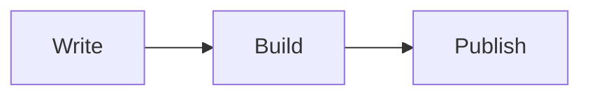
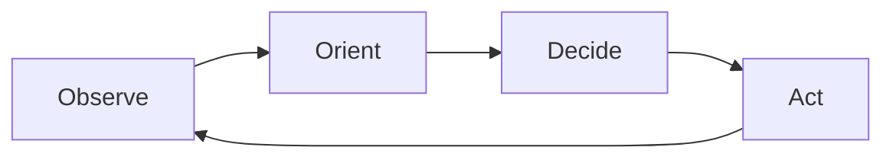

Welcome to your new Arcadia site. Delete this post when you're ready to start writing — or use it as a reference for the features described below.^[This is a sidenote. On wide screens it floats into the right margin alongside the text it annotates. Use `^[text]` to create one.]

Arcadia is built around a simple idea: plain markdown in, clean HTML out. There is no framework, no bundler, no configuration required beyond a site title.>[This is a margin note — unnumbered, same position as a sidenote. Use `>[text]` to create one.] The output is a folder of static files you can host anywhere.

---

## Diagrams

Arcadia renders [Mermaid](https://mermaid.js.org/) diagrams inline — no JavaScript, no build plugins. Drop a fenced `mermaid` block anywhere in a post:



Directed cycles work too — the OODA loop:



---

## Structure

Section breaks (`---`) divide a post into `<section>` elements, which is the structural unit Tufte CSS expects. Use them to group related ideas, not just to add visual space.

Tags appear below the title and link to a generated tag index. Add them in frontmatter:

```yaml
tags: [guide, writing]
```
