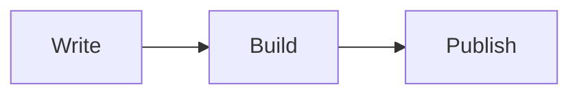

Welcome to your new Arcadia site.^[This is a sidenote. On wide screens it floats into the right margin. Use `^[text]` to create one, or `>[text]` for an unnumbered margin note.]

---

## Diagrams

Arcadia renders [Mermaid](https://mermaid.js.org/) diagrams inline — no JavaScript, no build plugins. Drop a fenced `mermaid` block anywhere in a post:

Section breaks (`---`) divide a post into `<section>` elements, which is the structural unit Tufte CSS expects.
